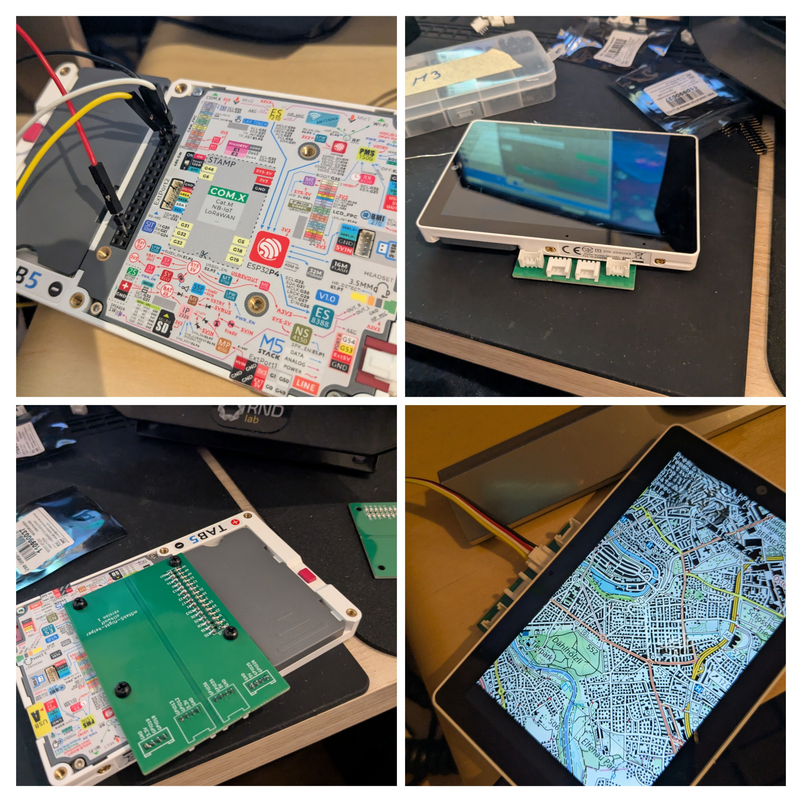

# m5tab5-flighthelper
Simple Flighthelper project. Porting the old one from the m5stack to the m5tab5 and while trying out different llms.
 
The basis is the M5Stack Tab5 replacing the M5Stack Core2 Project. 
https://github.com/oli4wolf/flight-helper 
It comes with a bigger Screen (5" at 1280x720). A Tile is 256x256. So 5x3 <vr>

## Next Step ##
Reduce the canvas drawing on screen to 3x3.